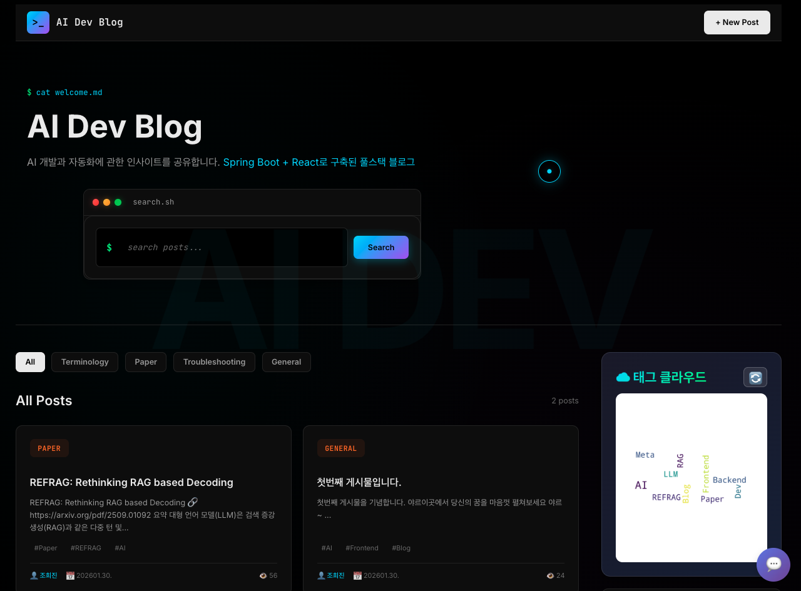
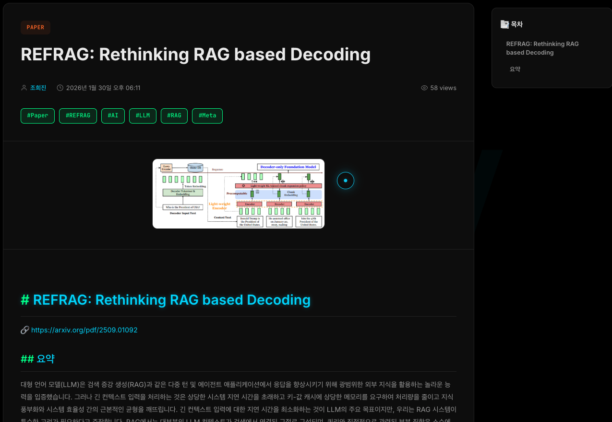
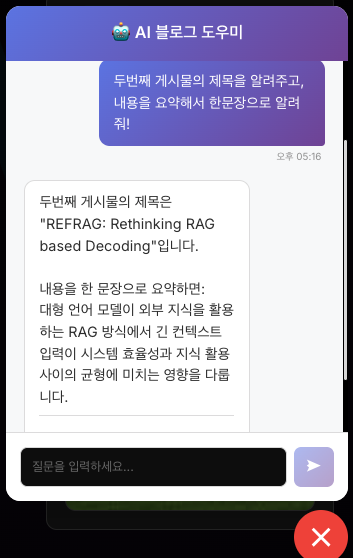

# 🤖 AI Dev Blog

> Spring Boot + React + FastAPI로 구축한 AI 기반 개발 블로그 (풀스택 프로젝트)

<div align="center">


[데모 보기](#-주요-화면) | [기능 소개](#-주요-기능) | [설치 방법](#-빠른-시작)

</div>

---

## 📸 주요 화면

<div align="center">

### 메인 페이지 & 게시글 상세
   

### AI 챗봇 도우미


</div>

---

## ✨ 주요 기능

### 📝 **콘텐츠 관리**
- 마크다운 에디터 (실시간 미리보기)
- 카테고리 & 태그 기반 분류
- 이미지 업로드
- 통합 검색 (제목/내용/작성자)

### 🤖 **AI 기능**
- **AI 챗봇 도우미** - 블로그 게시글 기반 질의응답
- **태그 워드클라우드** - Python 기반 자동 생성

### 💬 **소셜 기능**
- 댓글 시스템
- 좋아요 (IP 기반 중복 방지)
- 조회수 카운팅

### 📊 **UX**
- 반응형 디자인
- 페이지네이션
- 자동 목차(TOC) 생성

---

## 🛠️ 기술 스택
```
Frontend  →  React 18 + React Router + Axios
Backend   →  Spring Boot 3.2 + JPA + MySQL 8.0 + Gradle
AI        →  FastAPI + Python + LLM
DevOps    →  Docker Compose + CORS
```

---


## 📂 프로젝트 구조
```
ai_blog/
├── ai/                # FastAPI 챗봇 서버
├── backend/           # Spring Boot API
├── frontend/          # React 앱
└── docker-compose.yml # MySQL 컨테이너
```

<details>
<summary>📁 상세 구조 보기</summary>
```
ai_blog/
├── ai/
│   ├── chatbot_api.py          # FastAPI 챗봇 서버
│   ├── word_cloud_generator.py # 워드클라우드 생성
│   └── requirements.txt
│
├── backend/
│   ├── src/main/java/com/aiblog/
│   │   ├── model/              # Entity
│   │   ├── dto/                # Request/Response
│   │   ├── repository/         # JPA Repository
│   │   ├── service/            # 비즈니스 로직
│   │   ├── controller/         # REST API
│   │   └── config/             # 설정
│   └── build.gradle
│
└── frontend/
    ├── src/
    │   ├── components/         # 재사용 컴포넌트
    │   ├── pages/              # 페이지
    │   └── services/           # API 호출
    └── package.json
```

</details>

---

## 🗄️ 주요 API

| Method | Endpoint | 설명 |
|--------|----------|------|
| GET | `/api/posts` | 게시글 목록 (페이징/검색/필터) |
| POST | `/api/posts` | 게시글 작성 |
| GET | `/api/posts/{id}` | 게시글 상세 |
| POST | `/api/chat` | AI 챗봇 질문 |
| GET | `/api/wordcloud/image` | 워드클라우드 이미지 |

---

## 📝 개발 노트

### ✅ 구현 완료
- RESTful API 설계
- Spring Data JPA 활용
- React Hooks 상태 관리
- 마크다운 에디터
- AI 챗봇 (FastAPI 분리)
- 워드클라우드 자동 생성

### 🎯 향후 계획
- [ ] JWT 인증/인가
- [ ] 댓글 대댓글
- [ ] 관리자 대시보드
- [ ] 더 많은 AI 기능 추가 예정 🤩

---

## 📄 라이센스

개인 학습용 프로젝트

---

<div align="center">

**⭐ 이 프로젝트가 도움이 되었다면 Star를 눌러주세요!**

</div>