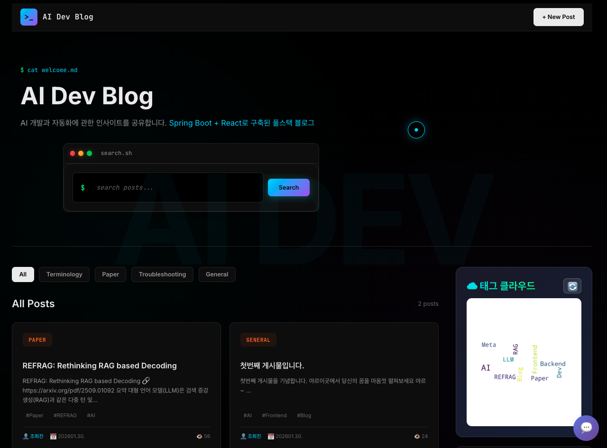
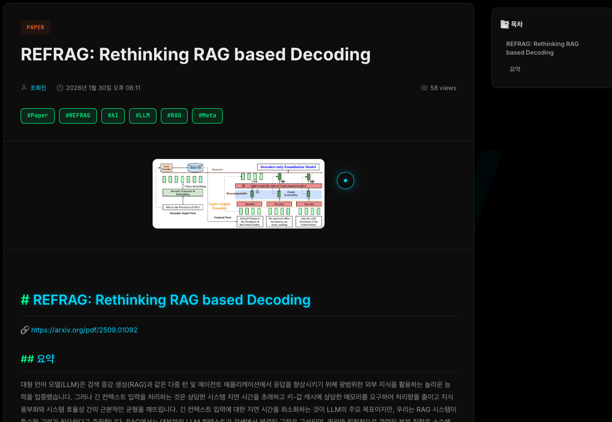
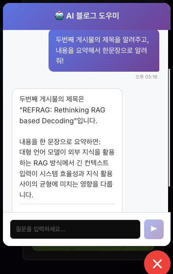

# 🤖 AI Dev Blog

> Spring Boot + React + FastAPI로 구축한 AI 기반 개발 블로그 (풀스택 프로젝트)

<div align="center">


</div>

---

## 📸 주요 화면

<div align="center">

### 메인 페이지 & 게시글 상세
   

### AI 챗봇 도우미


</div>

---

## ✨ 주요 기능

### 📝 **콘텐츠 관리**
- 마크다운 에디터 (실시간 미리보기)
- 카테고리 & 태그 기반 분류
- 이미지 업로드
- 통합 검색 (제목/내용/작성자)

### 🤖 **AI 기능**
- **AI 챗봇 도우미** - 블로그 게시글 기반 질의응답
- **태그 워드클라우드** - Python 기반 자동 생성

### 💬 **소셜 기능**
- 댓글 시스템
- 좋아요 (IP 기반 중복 방지)
- 조회수 카운팅

### 📊 **UX**
- 반응형 디자인
- 페이지네이션
- 자동 목차(TOC) 생성

---

## 🛠️ 기술 스택
```
Frontend  →  React 18 + React Router + Axios
Backend   →  Spring Boot 3.2 + JPA + MySQL 8.0 + Gradle
AI        →  FastAPI + Python + LLM
DevOps    →  Docker Compose + CORS
```

---

## 📝 개발 노트

### ✅ 구현 완료
- RESTful API 설계
- Spring Data JPA 활용
- React Hooks 상태 관리
- 마크다운 에디터
- AI 챗봇 (FastAPI 분리)
- 워드클라우드 자동 생성

### 🎯 향후 계획
- [ ] JWT 인증/인가
- [ ] 댓글 대댓글
- [ ] 관리자 대시보드
- [ ] 더 많은 AI 기능 추가 예정 🤩

---

## 📄 라이센스

개인 학습용 프로젝트

---

<div align="center">

**⭐ 이 프로젝트가 도움이 되었다면 Star를 눌러주세요!**

</div>